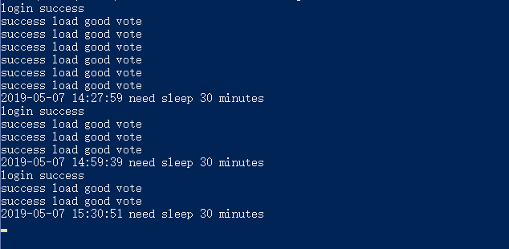

# alexamaster-autovote
通过puppeteer，实现alexamaster自动刷Good Votes

有关alexamaster的介绍，可以[看此文章](https://www.youneed.win/alexamaster基本介绍，闲置vps挂机赚钱.html)。
本项目除了刷Good Votes外，还可以执行其他的所有任务，包括Facebook点赞、YouTube视频播放。下面讲述了本项目的具体使用方法
 
2020.02.11更新：视频经常出问题，已经暂时停止此功能。目前只刷Good Votes、Facebook点赞。
 
## 运行环境

本项目依赖node.js，因此使用之前，请先确保安装了最新稳定版本的Node。

由于npm安装的HeadLess Chrome播放视频有问题，所以需要自己在运行的电脑或者服务器上安装原生的Chrome。

### 1. Windows上运行
Windows上运行本程序时，请按照默认设置安装Chrome浏览器，并确定安装路径是否在 `C:/Program Files (x86)/Google/Chrome/Application/`,
如果不是，请修改lib/pub.js中的chromePah为你的Chrome安装路径。

### 2. Linux上运行
Linux上安装Chrome参考：

Debians上安装：
> * wget https://dl.google.com/linux/direct/google-chrome-stable_current_amd64.deb
> * sudo apt install ./google-chrome-stable_current_amd64.deb
	
Centos上安装：
> * wget https://dl.google.com/linux/direct/google-chrome-stable_current_x86_64.rpm 
> * yum install -y google-chrome-stable_current_x86_64.rpm

查看Chrome版本信息：
> * /opt/google/chrome/chrome --version

一定要确保Chrome的安装目录为/opt/google/chrome，这样才能正常运行！！

## 运行程序

- 克隆本项目代码 `clone https://github.com/dxxzst/alexamaster-autovote.git`
- 在lib/pub.js文件中修改你的账号user、密码password，并确定chromePah是否正确
- 进入目录 `cd alexamaster-autovote`
- 安装资源 `npm install`
- 启动服务 `npm run` 或 `node index.js`

程序运行后，会输出运行的log，内容为已经执行的任务

2020.02.07更新：	添加验证码读取，需要手动输入。一般输入一次即可。

## 备注

- 程序运行时，会自动检查错误，出现错误后会自动重启浏览器。

- 如果当前任务都已执行完毕，会休息30分钟。

- 任务中的Good Votes默认都是选的白色背景，目前测试暂无问题。

- 程序默认设置为headless模式，看不到浏览器。如果在windows系统中运行，又想看到浏览器，可以将run.js中的`headless: true`改为`headless: false`

**如本项目对您有所帮助，欢迎Star。如有任何问题也欢迎提出issue。**
